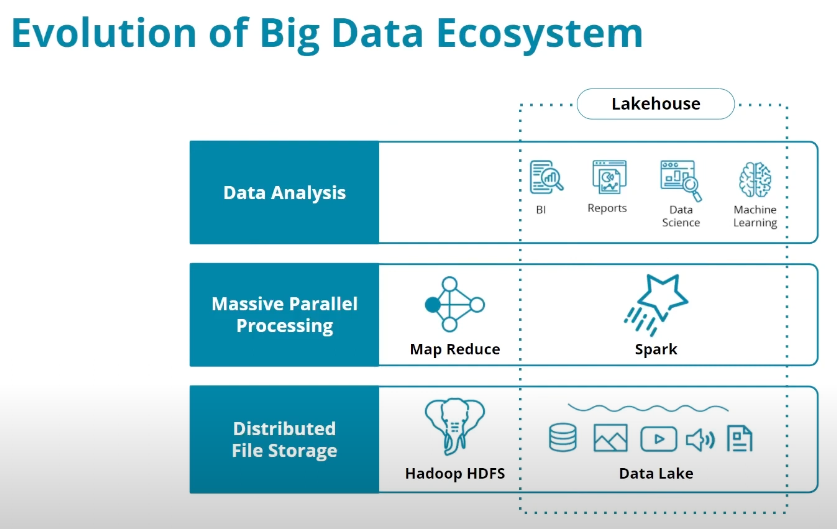
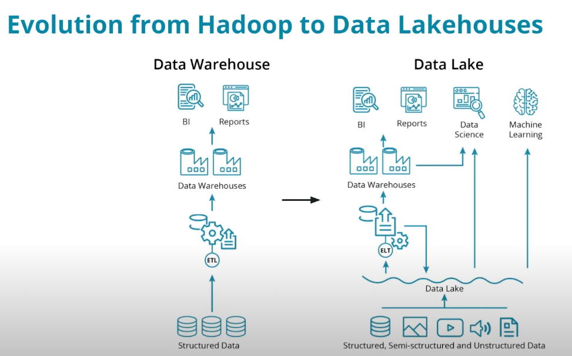

# Spark and Data Lakes

## 1 - Introduction to Spark and Data Lakes

This course covers hands-on exercises and a project to develop skills in the following areas:

* Big Data Engineering and Ecosystem
* Apache Spark
* Using Spark with Amazon Web Services (AWS)
* Building a data lake house on AWS

Tools will be used:
* **Python**
    * Python and the Pyspark Python API for Apache Spark to write Spark Scripts
* **Apache Spark**
    * a distributed system for processing big data
* **Amazon Web Services (AWS)**
    * Simple Storage Service (S3)
    * Glue, Glue Studio
    * Glue Catalog, Glue Tables
    * Athena

---

## 2 - Big Data Ecosystem, Data Lakes, and Spark

* The modern big data ecosystem is an evolution of **data processing** on **distributed architecture** necessary to handle the sheer volume of data.
* Data Engineers skillfully use modern tools and techniques to create the big data ecosystem.

### Evolution of Big Data Ecoystem

<figure>
  
</figure>

* Early efforts at processing large amounts of structured, semi-structured, and unstructured data led to the development of **Hadoop**. Hadoop incorporates two key components:

    * The **Hadoop Distributed File System** (or _HDFS_) provides distributed storage with high-throughput access to data.
    * **MapReduce** provides a way to conduct massive parallel processing for large amounts of data.

* Next step is the evolution of **Apache Spark**
    * built on the ideas of Hadoop, a faster way to process large amounts of data
    * provided multiple programming APIs for processing data
    * providing an interactive interact for iteractively developing data engineering and data science solutions 

* Hadoop + Spark led to the development and popularity of **Data Lakes**
    * to process large amounts of both structured and unstructured data 

* Finally, the lastest step in the evolution is the **Lakehouse Architecutre**
    * seeks to combine the strength of both data lakes and **data warehouses**

### Lesson Objectives
_By the end of this lesson, you will be able to:_
* Identify technologies and components of the Hadoop framework
* Explain what Spark is, and when to use it
* Explain the features and evolution of data lakes in the big data ecosystem

### From Hadoop to Data Lakehouse Architecture

<figure>
  
</figure>

Hadoop and Spark enabled the evolution of the data warehouse to the data lake.

* Data warehouses are based on specific and explicit data structures that allow for highly performant business intelligence and analytics but they do not perform well with unstructured data.

* Data lakes are capable of ingesting massive amounts of both structured and unstructured data with Hadoop and Spark providing processing on top of these datasets.

* Data lakes have several shortcomings that grew out of their flexibility. 
    * They are unable to support transactions and perform poorly with changing datasets. 
    * Data governance became difficult due to the unstructured nature of these systems.

* Modern lakehouse architectures seek to combine the strengths of data warehouses and data lakes into a single, powerful architecture.

### The Hadoop Ecosystem

#### Hadoop Framework
<figure>
  
</figure>

The Hadoop framework consists of four main components:

* **Hadoop** - an ecosystem of tools for big data storage and data analysis. Hadoop is an older system than Spark but is still used by many companies. The major difference between Spark and Hadoop is _how they use memory_. Hadoop writes intermediate results to disk whereas Spark tries to keep data in memory whenever possible. 

* **Hadoop Distributed File System (HDFS)** - a big data storage system that splits data into chunks and stores the chunks across a cluster of computers.

* **Hadoop MapReduce** - a system for processing and analyzing large data sets in parallel.

* **Hadoop YARN** - a resource manager that schedules jobs across a cluster. The manager keeps track of what computer resources are available and then assigns those resources to specific tasks.

As Hadoop matured, other tools were developed to make Hadoop easier to work with. These tools included:

* **Apache Pig** - a SQL-like language that runs on top of Hadoop MapReduce
* **AApache Hive** - another SQL-like interface that runs on top of Hadoop MapReduce

#### How is Spark related to Hadoop?

* Spark is another big data framework that contains libraries for data analysis, machine learning, graph analysis, and streaming live data. 
* Spark is generally faster than Hadoop, because Hadoop writes intermediate results to disk whereas Spark tries to keep intermediate results in memory whenever possible.
* Hadoop ecosystem includes a distributed file storage system - HDFS. Spark, does not include a file storage system. You can use Spark on top of HDFS but you do not have to. Spark can read in data from other sources as well.

#### Streaming Data

* use case - store and analyze data in real-time
* popular streaming libraries: 
    * [Spark Streaming](https://spark.apache.org/docs/latest/streaming-programming-guide.html)
    * [Apache Storm](https://storm.apache.org/)
    * [Apache Flink](https://flink.apache.org/)

### MapReduce

MapReduce is a programming technique for manipulating large data sets. "Hadoop MapReduce" is a specific implementation of this programming technique.

The technique works by first dividing up a large dataset and distributing the data across a cluster. 
* `MAP` - In the map step, each data is analyzed and converted into a (key, value) pair, i.e. a tuple. 
* `SHUFFLE` - Then these key-value pairs are shuffled across the cluster so that all keys are on the same machine. 
* `REDUCE` - In the reduce step, the values with the same keys are combined (aggregated) together.

**Exercise 1**: [MapReduce](exercises/1-mapreduce_practice.ipynb)

### Why Spark?
Spark is currently one of the most popular tools for big data analytics. 

There are many other big data tools and systems, each with its own use case. For example:
* database system: [Apache Cassandra](https://cassandra.apache.org/_/index.html)
* SQL query engine: [Presto](https://prestodb.io/)

### Spark Cluster

Distributed computing 
* refer to a big computational job executing across a cluster of nodes
* each node is responsible for a set of operations on a subset of the data
* combine these partial results to get the final answer 

Most computational frameworks are organized into a `master-worker hierarchy`
* The master node is responsible for orchestrating the tasks across the cluster
* Workers are performing the actual computations

Four different modes to set up Spark: `Local mode` + `Standalone` + `YARN` + `Mesos` 
<figure>
  
</figure>

* Local Mode: 
    * everything happens on a single machine (such as your own computer), 
    * while we use spark's APIs, we don't really do any distributed computing
    * can be useful to learn syntax and to prototype your project
    * _In Spark's Standalone mode there is a **Driver Process**. If you open a Spark shell, either Python or Scala, you are directly interacting with the driver program. It acts as the **master** and is responsible for scheduling tasks_
* Cluster Mode: 
    * _distributed and declare a **cluster manager** which is a separate process that monitors available resources and makes sure that all machines are responsive during the job_
    * three different options of cluster managers: 
        * Spark's own Standalone Customer Manager
        * YARN from the Hadoop project
        * Mesos - another open-source manager from UC Berkeley's AMPLab Coordinators

### Spark Use Cases
Resources about different Spark use cases:
* [Data Analytics](https://spark.apache.org/sql/) - Spark SQL is Apache Spark's module for working with structured data
* [Machine Learning](https://spark.apache.org/mllib/) - MLlib is Apache Spark's scalable machine learning library
* [Streaming](https://spark.apache.org/streaming/) - [Spark Structured Streamin](https://spark.apache.org/docs/latest/structured-streaming-programming-guide.html) makes it easy to build streaming applications and pipelines with the same and familiar Spark APIs
* [Graph Analytics](https://spark.apache.org/graphx/) - GraphX is Apache Spark's API for graphs and graph-parallel computation

#### Spark's Limitations
* High Latency - Spark Streaming’s latency is at least 500 milliseconds since it operates on micro-batches of records, instead of processing one record at a time 
    * native streaming tools such as [Storm](https://storm.apache.org/), [Apex](https://apex.apache.org/), or [Flink](https://flink.apache.org/) can push down this latency value and might be more suitable for low-latency applications
* Selection of machine learning algorithms
    * currently, Spark only supports algorithms that scale linearly with the input data size
    * in general, deep learning is not available either

#### Beyond Spark for Storing and Processing Big Data
*  Spark is not a data storage system, and there are a number of tools besides Spark that can be used to process and analyze large datasets
* Sometimes it makes sense to use the power and simplicity of SQL on big data - a new class of databases: `NoSQL` and `NewSQL`, for example: 
    * newer database storage systems like [HBase](https://hbase.apache.org/) or [Cassandra](https://cassandra.apache.org/_/index.html)
    * distributed SQL engines like [Impala](https://impala.apache.org/) and [Presto](https://prestodb.io/)

### Data Lakes
Data lakes are an evolution beyond data warehouses and allow an organization to ingest massive amounts of both **structured** and **unstructured** data into storage.

<figure>
  
</figure>

One of the key differences between data warehouses and data lakes is the inclusion of structured versus unstructured data.
* Data warehouses consist of only highly structured data that is suitable for business intelligence and reporting needs.
* Often data science and machine learning efforts need access to all data, including unstructured data. Data lakes provide the ability to serve up both types of data from a single data store

#### Key Features of Data Lakes

<figure>
  
</figure>

* Lower costs associated with using big data tools for ETL / ELT operations.
* Data lakes provide schema-on-read rather than schema-on-write which lowers the cost and work of ingesting large amounts of data.
* Data lakes provide support for structured, semi-structured, and unstructured data.

### Data Lakes, Lakehouse, and Spark
Depending on what you are doing, Apache Spark can fill all three of these roles: 
* Data engineering tool
* Data analytics tool
* Data science tool

#### Apache Spark, Data Lakes, and Lakehouse

<figure>
  
</figure>

* Apache Spark can be used to perform data engineering tasks for building both `data lakes` and `lakehouse architectures`.
* Most often, these data engineering tasks consist of `ETL` or `ELT` tasks. The difference between ETL and ELT is simply the order of operations.
* Apache Spark allows the data engineer to perform these tasks, along with raw data ingestion using the language of their choice with support for Python, R, SQL, Scala, and Java.

### Data Lakehouse
Data lakes were a huge step forward from data warehouses but some of their key features led to weaknesses. With the need to ingest a large amount of unstructured data, we _lost_:
* Atomic transactions: failed production jobs left data in a corrupted state.
* Quality enforcement: inconsistent and therefore unusable data.
* Consistency in data structures: impossible to stream and batch process data while ingesting.

These shortcomings led the industry to seek better solutions.

#### Lakehouse Architecture
The key innovation of the lakehouse architecture is the creation of a `metadata` and `data governance` layer on top of the data lake.

<figure>
  
</figure>

* This creates a pool of raw data as well as a curated set of data.
* This provides the flexibility and benefits we previously saw with data lakes, and it also provides solutions to the weaknesses in data lakes.

#### Lakehouse Architecture Features
One of the important features of a lakehouse architecture is the ability to quickly ingest large amounts of data and then incrementally improve the quality of the data. We can think of this process using the colors we often associate with Olympic medals.

<figure>
  
</figure>

* Raw ingested data can be considered `bronze`.
* After some filtering, cleaning, and augmenting, the data can be considered `silver`.
* Finally, with the addition of business-level aggregates such as you might see with a _**star schema**_, data can be considered `gold` and ready for analytics and reporting needs.

#### Differences Between Data Lakes and Lakehouse Architecture
The key difference between data lakes and data lakehouse architectures is the inclusion of the _metadata and governance layer_.

This is the crucial ingredient that provides atomicity, data quality, and consistency for the underlying data lake.

---
