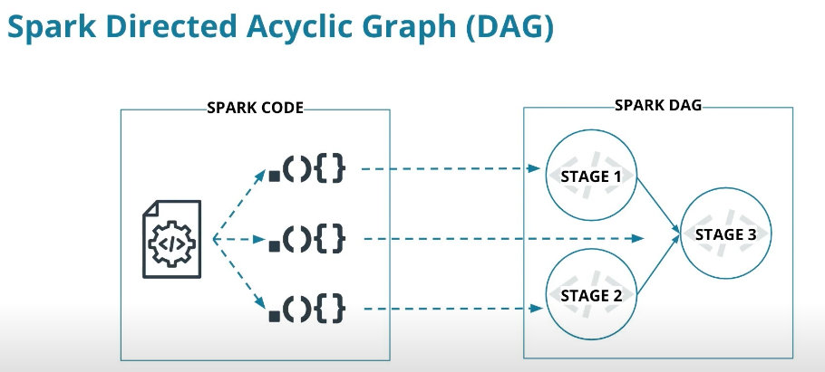

# Spark and Data Lakes

## 3 - Spark Essentials
Dive into how to use Spark for wrangling, filtering, and transforming distributed data with PySpark and Spark SQL.
* Wrangling data with Spark
* Functional programming
* Reading in and writing out different types of data and data formats
* The Spark environment and Spark APIs
* The Spark RDD API

### 3.1 - Introduction to Spark Essentials
#### Lesson Outline
* Introduction to Spark
    * _Spark directed acyclic graph (DAG)_
    * _Resilient Distributed Datasets (RDD)_
* Maps and Lambda functions
    * _Spark Context Object_
    * _Lay Evalution_
    * _Anonymous Functions_
* Data Wrangling with Spark
    * _Reading and Writing data into Spark DataFrames_
    * _Imperative vs. Declarative Programming_
    * _DataFrame Functions_
* Spark SQL
    * _Querying with SQL_
    * _DataFrames vs. SQL_

### Leson Objectives
_By the end of this lesson, you’ll be able to:_
* Explain how the Spark DAG enables parallel processing of large datasets
* Use map and lambda Spark functions
* Manipulate data with SparkSQL and Spark DataFrames

### 3.2 - The Spark DAG: Teamwork for Data Processing
Apache Spark distributes data processing tasks over a cluster of distributed computing resources.

<figure>
  
</figure>

**Lazy evaluation in the Spark DAG**

<figure>
  
</figure>

Resources
* [Spark Documentation](https://spark.apache.org/docs/latest/)
* [Spark Cluster Overview](https://spark.apache.org/docs/3.0.2/cluster-overview.html)

### 3.3 - Resilient Distributed Datasets (RDDs)
Resources
* Further explanation of the difference between RDDs and DataFrames in Databricks' [A Tale of Three Apache Spark APIs: RDDs, DataFrames, and Datasets](https://www.databricks.com/blog/2016/07/14/a-tale-of-three-apache-spark-apis-rdds-dataframes-and-datasets.html) blog post.
* Spark documentation's [RDD programming guide](https://spark.apache.org/docs/latest/rdd-programming-guide.html).

### 3.4 - PySpark and SparkSession

### 3.5 - Maps and Lambda Functions in Spark

### 3.6 - Exercise: Maps and Lambda Functions

#### Exercise and Practice Repository
You can find the starter code and solutions to the practice scripts and exercises in [Github here](https://github.com/udacity/nd027-Data-Engineering-Data-Lakes-AWS-Exercises), as well as downloading them from the workspaces using the right-click menu and choosing Download

### 3.9 - Distributed Data Stores