# Using Spark in AWS with Data Lakes (notes)

## 1 - Intro - Lesson Outline

* Data Lakes in AWS
    * _Structured and Unstructured Data_
    * _AWS S3 Data Lakes_
* Using Spark on AWS
    * _EC2 instances_
    * _AWS EMR_
    * _AWS Glue_
* AWS Glue
    * _Glue Service Components_
    * _Spark Glue jobs_
    * _Creating and Running Glue jobs_

## Lesson Objectives 

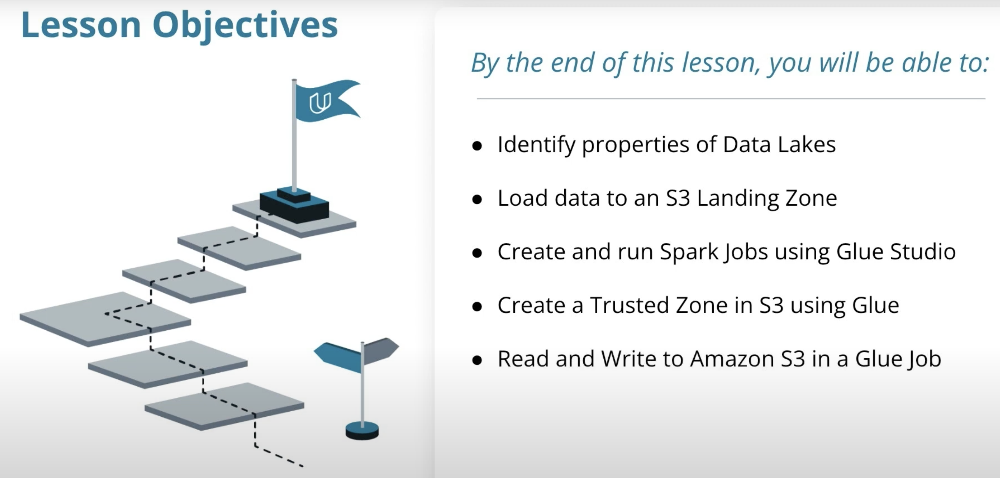

___

## 2 - Data Lakes in AWS

A lake is a large body of water. It is usually a naturally occurring feature. If your organization has large amounts of data somewhere, you have a data lake! 
* in an `unstructured` format (Text, Multimedia, etc.)
* or `semi-structured` format (CSV, JSON, Parquet, and other formats)

Data Lakes are not a specific technology. They can be implemented using many types of file storage systems. 

* In AWS, the most common way to store files is in S3. We can implement data lakes using S3 storage. 
* S3 buckets are an abstraction of storage similar to HDFS. They make it possible to store an almost unlimited amount of data and files.
* In the AWS Cloud, S3 buckets make file storage availabe on a network and enable systems and people to exchange data. 

    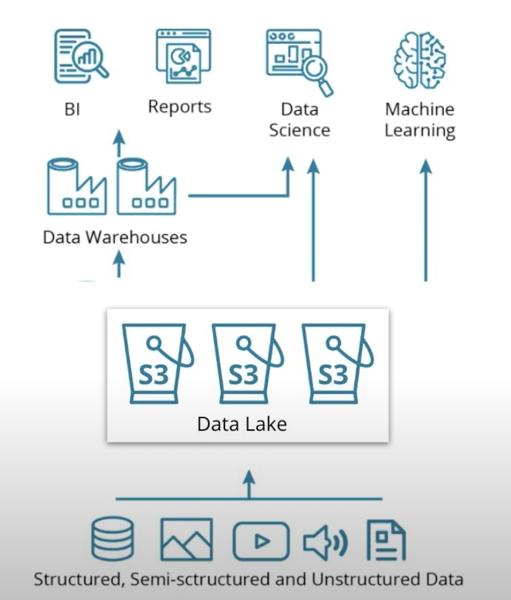

In the rest of the lesson, we'll see how to use S3 data lake to store and process data with Spark


___ 

## 3 - Using Spark on AWS

Choices to rent a cluster of machines on AWS to run Spark: 

* EMR (Elastic MapReduce)
    * AWS managed Spark service
    * a scalable set of EC2 machines already configured to run Spark
    * no need to manage the systems, only configure the necessary cluster resources
    * Distributed Computing
    * HDFS Installed
    * Billing Model: EC2 costs
    * Provisioning: Automated

* EC2
    * Use AWS Elastic Compute (EC2) machines 
    * Install and configure Spark and HDFS yourself
    * Distributed Computing
    * HDFS Installed
    * Billing Model: EC2 costs
    * Provisioning: Self Installed

* Glue
    * A serverless Spark environment with added libraries like the Glue Context and Glue Dynamic Frames
    * Also interfaces with other AWS data services like Data Catalog and AWS Athena
    * Distributed Computing
    * Serverless: Yes
    * HDFS Installed
    * Billing Model: Job Duration
    * Provisioning: Zero Provisioning


We'll focus on using the AWS Glue tool to run Spark scripts in this course.


#### _Circling Back on HDFS_
Since Spark does not have its own distributed storage system, it leverages using `HDFS` or `AWS S3`, or any other distributed storage. Primarily in this course, we will be using AWS S3. 

#### _MapReduce System_
* HDFS uses MapReduce system as a resource manager to allow the distribution of the files across the **hard drives** within the cluster. 
* Spark, on the other hand, runs the operations and holds the data in the **RAM memory** rather than the hard drives used by HDFS. 

_Since Spark lacks a file distribution system to organize, store and process data files, Spark tools are often installed on Hadoop because Spark can then use the Hadoop Distributed File System (HDFS)._

#### _Why Would You Use an EMR Cluster?_
* Since a Spark cluster includes multiple machines, in order to use Spark code on each machine, we would need to download and install Spark and its dependencies. 
* AWS EMR negates the need users to go through the manual process of installing Spark and its dependencies for each machine.


**Quiz Question**

_What are some characteristics of the AWS EMR standalone mode?_
* AWS EMR standalone mode is both distributed and a resource manager.

___ 

## 4 - Introduction to AWS Glue

### Glue Studio 

* Glue is an AWS Service that relies on Spark. 
* we can use Glue Studio to write purely Spark scripts.

Using AWS Glue to run Spark Jobs requires the following resources and configuration:

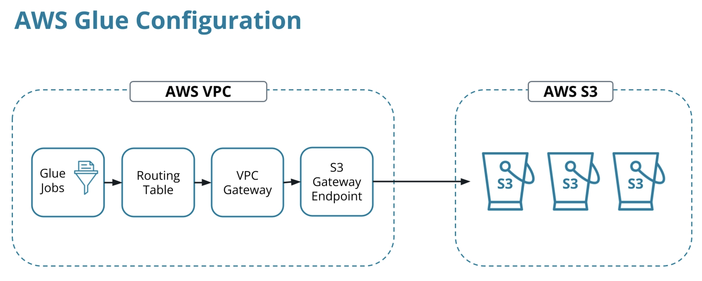

#### Routing Table
* an entity that stores the network paths to various locations
* e.g.: will store the path to S3 from within your VPC
* will need a routing table to configure with your VPC Gateway

#### VPC Gateway
* cloud project runs resources within a Virtual Private Cloud (VPC)
* i.e. Glue Job runs in a Secure Zone without access to anything outside your Virtual Network
* a network entity gives access to outside networks and resources since S3 is a shared service and doesn't reside in VPC

#### S3 Gateway Endpoint
* by default, Glue Jobs can't reach any networks outside of VPC
* since S3 runs in different network, we need to create an S3 Gateway Endpoint
* it allows S3 traffic from your Glue Jobs into your S3 buckets
* once created the endpoint, Glue Jobs will have a network path to reach S3

#### S3 Buckets
* buckets are storage locations within AWS, that have a hierarchical directory-like structure. 
* the bucket is the "parent" of all the sub-directories and files

___ 

## 5 - Configuring AWS Glue: S3 VPC Gateway Endpoint

### Step 1: Creating an S3 Bucket

To create an S3 bucket use the `aws s3 mb` command: `aws s3 mb s3://_______`

* Command: `aws s3 mb s3://dend-lake-house`
* Output:

    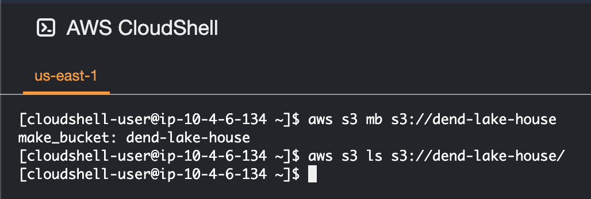


### Step 2: S3 Gateway Endpoint

* Use the AWS CLI to identify the VPC that needs access to S3: `aws ec2 describe-vpcs`
* Output (look for the `VpcId` in the output): 

    ```json
    {
        "Vpcs": [
            {
                "CidrBlock": "172.31.0.0/16",
                "DhcpOptionsId": "dopt-0fe50caf15bf4193c",
                "State": "available",
                "VpcId": "vpc-05f119bdeb0799d1b",
                "OwnerId": "072011872961",
                "InstanceTenancy": "default",
                "CidrBlockAssociationSet": [
                    {
                        "AssociationId": "vpc-cidr-assoc-068cc1bf37dbdddbe",
                        "CidrBlock": "172.31.0.0/16",
                        "CidrBlockState": {
                            "State": "associated"
                        }
                    }
                ],
                "IsDefault": true
            }
        ]
    }
    ```

### Step 3: Routing Table

* Identify the routing table you want to configure with your VPC Gateway: `aws ec2 describe-route-tables`
* Output (look for `RouteTableId`):

    ```json
    {
        "RouteTables": [
            {
                "Associations": [
                    {
                        "Main": true,
                        "RouteTableAssociationId": "rtbassoc-079ca41eff76efc8e",
                        "RouteTableId": "rtb-0247af10c27028544",
                        "AssociationState": {
                            "State": "associated"
                        }
                    }
                ],
                "PropagatingVgws": [],
                "RouteTableId": "rtb-0247af10c27028544",
                "Routes": [
                    {
                        "DestinationCidrBlock": "172.31.0.0/16",
                        "GatewayId": "local",
                        "Origin": "CreateRouteTable",
                        "State": "active"
                    },
                    {
                        "DestinationCidrBlock": "0.0.0.0/0",
                        "GatewayId": "igw-0cbdd11e2c6111614",
                        "Origin": "CreateRoute",
                        "State": "active"
                    }
                ],
                "Tags": [],
                "VpcId": "vpc-05f119bdeb0799d1b",
                "OwnerId": "072011872961"
            }
        ]
    }
    ```

### Step 4: Create an S3 Gateway Endpoint

Finally create the S3 Gateway, replacing the blanks with the `VPC ID` and `Routing Table ID`:

```sh
aws ec2 create-vpc-endpoint --vpc-id _______ --service-name com.amazonaws.us-east-1.s3 --route-table-ids _______
```

* Command:
```sh
aws ec2 create-vpc-endpoint --vpc-id vpc-05f119bdeb0799d1b --service-name com.amazonaws.us-east-1.s3 --route-table-ids rtb-0247af10c27028544
```

* Output:
    ```json
    {
        "VpcEndpoint": {
            "VpcEndpointId": "vpce-08f538186d80133fd",
            "VpcEndpointType": "Gateway",
            "VpcId": "vpc-05f119bdeb0799d1b",
            "ServiceName": "com.amazonaws.us-east-1.s3",
            "State": "available",
            "PolicyDocument": "{\"Version\":\"2008-10-17\",\"Statement\":[{\"Effect\":\"Allow\",\"Principal\":\"*\",\"Action\":\"*\",\"Resource\":\"*\"}]}",
            "RouteTableIds": [
                "rtb-0247af10c27028544"
            ],
            "SubnetIds": [],
            "Groups": [],
            "PrivateDnsEnabled": false,
            "RequesterManaged": false,
            "NetworkInterfaceIds": [],
            "DnsEntries": [],
            "CreationTimestamp": "2023-07-14T01:55:38+00:00",
            "OwnerId": "072011872961"
        }
    }
    ```

* [Exercise-1: Setting up an S3 VPC Gateway Endpoint](./exercises/concept1-setting-up-vpc-gateway/)

___ 

## 7 - Creating the Glue Service Role

* AWS uses Identity and Access Management (IAM) service to manage users, and roles (which can be reused by users and services). 
* A Service Role in IAM is a Role that is used by an AWS Service to interact with cloud resources.

### Step 1: Creating the Glue Service IAM Role

_For AWS Glue to act on your behalf to access S3 and other resources, you need to grant access to the Glue Service by creating an IAM Service Role that can be assumed by Glue:_

* Command:

```sh
 aws iam create-role --role-name my-glue-service-role --assume-role-policy-document '{
    "Version": "2012-10-17",
    "Statement": [
        {
            "Effect": "Allow",
            "Principal": {
                "Service": "glue.amazonaws.com"
            },
            "Action": "sts:AssumeRole"
        }
    ]
}'
```

* Output:

```json
{
    "Role": {
        "Path": "/",
        "RoleName": "my-glue-service-role",
        "RoleId": "AROARBRB57LAQT3T6G5YM",
        "Arn": "arn:aws:iam::072011872961:role/my-glue-service-role",
        "CreateDate": "2023-07-14T02:09:51+00:00",
        "AssumeRolePolicyDocument": {
            "Version": "2012-10-17",
            "Statement": [
                {
                    "Effect": "Allow",
                    "Principal": {
                        "Service": "glue.amazonaws.com"
                    },
                    "Action": "sts:AssumeRole"
                }
            ]
        }
    }
}
```


### Step 2: Grant Glue Privileges on the S3 Bucket

_To allow your Glue job read/write/delete access to the bucket and everything in it._

* ARN Format: `arn:[aws/aws-cn/aws-us-gov]:[service]:[region]:[account-id]:[resource-id]`

**Replace the blanks in the statement below with your S3 bucket name (`dend-lake_house`)**

* Command: 

```sh
aws iam put-role-policy --role-name my-glue-service-role --policy-name S3Access --policy-document '{
    "Version": "2012-10-17",
    "Statement": [
        {
            "Sid": "ListObjectsInBucket",
            "Effect": "Allow",
            "Action": [
                "s3:ListBucket"
            ],
            "Resource": [
                "arn:aws:s3:::dend-lake-house"
            ]
        },
        {
            "Sid": "AllObjectActions",
            "Effect": "Allow",
            "Action": "s3:*Object",
            "Resource": [
                "arn:aws:s3:::dend-lake-house/*"
            ]
        }
    ]
}'
```

_After s3 there are three colons `:::` without anything between them. That is because S3 buckets can be cross-region, and cross AWS account. For example you may wish to share data with a client, or vice versa. Setting up an S3 bucket with cross AWS account access may be necessary._


### Step 3: Glue Policy

_Give Glue access to data in special S3 buckets used for Glue configuration, and several other resources._

Use the following policy for general access needed by Glue:

* Command: 

```sh
aws iam put-role-policy --role-name my-glue-service-role --policy-name GlueAccess --policy-document '{
    "Version": "2012-10-17",
    "Statement": [
        {
            "Effect": "Allow",
            "Action": [
                "glue:*",
                "s3:GetBucketLocation",
                "s3:ListBucket",
                "s3:ListAllMyBuckets",
                "s3:GetBucketAcl",
                "ec2:DescribeVpcEndpoints",
                "ec2:DescribeRouteTables",
                "ec2:CreateNetworkInterface",
                "ec2:DeleteNetworkInterface",
                "ec2:DescribeNetworkInterfaces",
                "ec2:DescribeSecurityGroups",
                "ec2:DescribeSubnets",
                "ec2:DescribeVpcAttribute",
                "iam:ListRolePolicies",
                "iam:GetRole",
                "iam:GetRolePolicy",
                "cloudwatch:PutMetricData"
            ],
            "Resource": [
                "*"
            ]
        },
        {
            "Effect": "Allow",
            "Action": [
                "s3:CreateBucket",
                "s3:PutBucketPublicAccessBlock"
            ],
            "Resource": [
                "arn:aws:s3:::aws-glue-*"
            ]
        },
        {
            "Effect": "Allow",
            "Action": [
                "s3:GetObject",
                "s3:PutObject",
                "s3:DeleteObject"
            ],
            "Resource": [
                "arn:aws:s3:::aws-glue-*/*",
                "arn:aws:s3:::*/*aws-glue-*/*"
            ]
        },
        {
            "Effect": "Allow",
            "Action": [
                "s3:GetObject"
            ],
            "Resource": [
                "arn:aws:s3:::crawler-public*",
                "arn:aws:s3:::aws-glue-*"
            ]
        },
        {
            "Effect": "Allow",
            "Action": [
                "logs:CreateLogGroup",
                "logs:CreateLogStream",
                "logs:PutLogEvents",
                "logs:AssociateKmsKey"
            ],
            "Resource": [
                "arn:aws:logs:*:*:/aws-glue/*"
            ]
        },
        {
            "Effect": "Allow",
            "Action": [
                "ec2:CreateTags",
                "ec2:DeleteTags"
            ],
            "Condition": {
                "ForAllValues:StringEquals": {
                    "aws:TagKeys": [
                        "aws-glue-service-resource"
                    ]
                }
            },
            "Resource": [
                "arn:aws:ec2:*:*:network-interface/*",
                "arn:aws:ec2:*:*:security-group/*",
                "arn:aws:ec2:*:*:instance/*"
            ]
        }
    ]
}'
```

* [Exercise-2: Creating the Glue Service Role](./exercises/concept2-creating-the-glue-service-role/)
    * create the IAM Service Role Glue will assume when connecting with S3. 
    * The role defines the authorization level Glue will have in your S3 bucket.

___

## 9 - Spark Jobs

We will be using Glue Studio to write Spark jobs that can be automated, and set to run at certain intervals.

* Running Spark scripts at a time interval


## 10 - Create a Spark Job using Glue Studio

* Glue Studio is a GUI for interacting with Glue to create Spark jobs with added capabilities. 
* Glue APIs give access to things like Glue Tables, and Glue Context. 
* You can create Glue Jobs by writing, and uploading python code, but Glue Studio also provides a drag and drop experience. 

### Glue Studio Visual Editor

The Glue Studio Visual Editor allows you to select three types of nodes when creating a pipeline:
* `Source` - the data that will be consumed in the pipeline
* `Transform` - any transformation that will be applied
* `Target` - the destination for the data

### Create a Spark Job with Glue Studio

#### Step 1 - Define a Trusted Zone Path

_To create a Trusted Zone for customer data. This zone will contain JSON data for customers who opted in to share their data for research._

* copy the data into your own S3 bucket - clone the repo with the sample files in the AWS Cloud Shell:
    ```sh
    git clone https://github.com/udacity/nd027-Data-Engineering-Data-Lakes-AWS-Exercises
    ```
* cd into the new directory:
    ```sh
    cd nd027-Data-Engineering-Data-Lakes-AWS-Exercises/
    ```
* cd to the project/starter/customer sub-directory:
    ```sh
    cd cd ./project/starter/customer/
    ```
* `ls` (output: `customer-keep-1655293787679.json`) 
* copy that file using the `aws s3 cp` command to a destination which is going to be your S3 bucket:
    ```sh
    aws s3 cp ./customer-keep-1655293787679.json s3://dend-lake-house/customer/landing/
    ```
* output: 
    ```sh
    upload: ./customer-keep-1655293787679.json to s3://dend-lake-house/customer/landing/customer-keep-1655293787679.json
    ```
* should see that file: 
    ```sh
    aws s3 ls s3://dend-lake-house/customer/landing/
    ```

    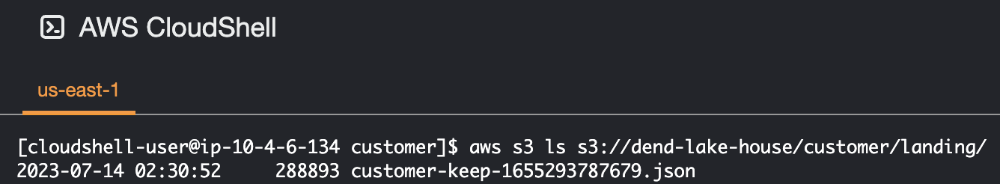

* _if needed, use the `aws s3 rm` command for remove to delete the file that no longer need, for example:_ 

    ```sh
    aws s3 rm s3://dend-lake-house/customer/landing/file-name.json
    ```

_Now we have the data that we need to process in the landing zone. The next step is to actually create the Glue job that will process that file._ 


#### Step 2 - Create the glue job that will process that file

* Search for "glue studio jobs" in the AWS Console, and go to `AWS Glue Studio` 
* Select `ETL jobs` from the Glue Studio menu
* To get started, go with the default selection - `Visual with a source and a target`, and click `Create`

    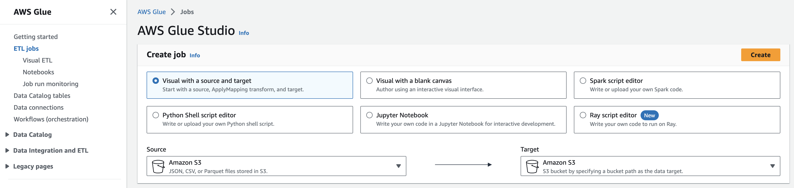


1. **Data Source** 
    * specify the S3 location - the dir and sub-dir that we just copied the file to
    * the data format is JSON
    * click on `infer schema`, the Glue job is going to look at the JSON data as a sample and find the fields in the JSON

        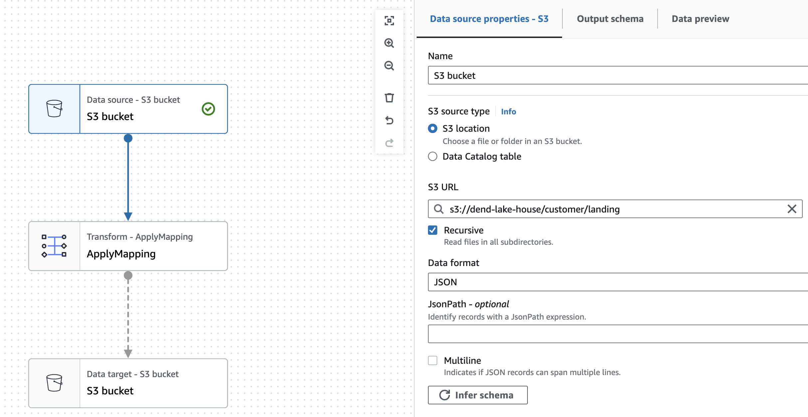

        

2. **Transform**

    _Create a privacy filter - not load customer data for research unless they've consented for us to do so_

    * change the node type from `Apply Mapping` to `Filter` and change the node name to `PrivacyFilter`
    * add a condition to filter for the ones that have a non-empty consent date: 

        ```sh
        shareWithResearchAsOfDate != 0 
        ```
    _The `shareWithResearchAsOfDate` timestamp field will be cast as a `zero` if it is empty (a customer didn't give consent)_

    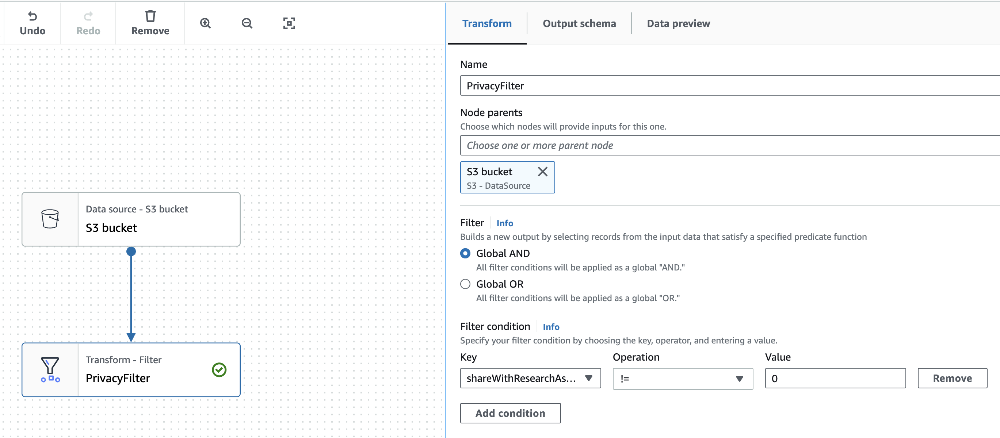

3. **Target**
    * Name: `Trusted Customer Zone`
    * specify the destination `s3://dend-lake-house/customer/trusted/`

        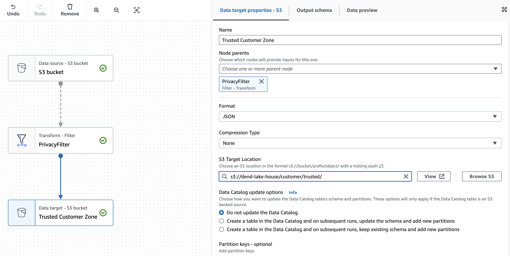

    * we can also check in the Cloud Shell: 

        ```sh
        aws s3 ls s3://dend-lake-house/customer/trusted/
        ```

* Click on `Job details`
    * give it a descriptive name - `Customer Landing to Trusted`
    * use the IAM Role that created earlier `my-glue-service-role`
    * check the Glue version and Python version is the latest
    * `Job Bookmark` - by default it will not load the same file twice, we want to `disable` this since we're learning and we don't want it to skip files
    * update the Glue Script name to look more like a Python script name - `customer_landing_to_trusted.py`
    * click `Save` and `Run`
    * click on the `Runs` page and see the status and logs

        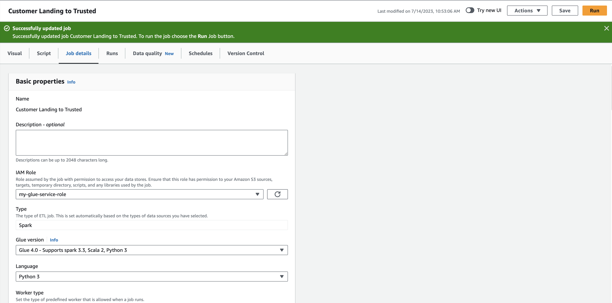
        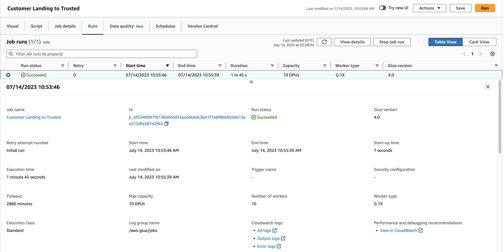

#### View the Generated Script

* We can download the Python code/Glue Script - `customer_landing_to_trusted.py`:

    ```python
    import sys
    from awsglue.transforms import *
    from awsglue.utils import getResolvedOptions
    from pyspark.context import SparkContext
    from awsglue.context import GlueContext
    from awsglue.job import Job
    import re

    args = getResolvedOptions(sys.argv, ["JOB_NAME"])
    sc = SparkContext()
    glueContext = GlueContext(sc)
    spark = glueContext.spark_session
    job = Job(glueContext)
    job.init(args["JOB_NAME"], args)

    # Script generated for node S3 bucket
    S3bucket_node1 = glueContext.create_dynamic_frame.from_options(
        format_options={"multiline": False},
        connection_type="s3",
        format="json",
        connection_options={
            "paths": ["s3://dend-lake-house/customer/landing"],
            "recurse": True,
        },
        transformation_ctx="S3bucket_node1",
    )

    # Script generated for node PrivacyFilter
    PrivacyFilter_node1689302643878 = Filter.apply(
        frame=S3bucket_node1,
        f=lambda row: (not (row["shareWithResearchAsOfDate"] == 0)),
        transformation_ctx="PrivacyFilter_node1689302643878",
    )

    # Script generated for node Trusted Customer Zone
    TrustedCustomerZone_node1689302785277 = glueContext.write_dynamic_frame.from_options(
        frame=PrivacyFilter_node1689302643878,
        connection_type="s3",
        format="json",
        connection_options={
            "path": "s3://dend-lake-house/customer/trusted/",
            "partitionKeys": [],
        },
        transformation_ctx="TrustedCustomerZone_node1689302785277",
    )

    job.commit()
    ``` 

### Analyzing Glue Code

_In addition to a SparkContext, we have a concept called a `GlueContext`. We are also using something called `Dynamic Frames`. Dynamic Frames are very similar to Data Frames, with the added capabilities of `Glue APIs` we mentioned earlier, such as sources, transformations, and destinations._


### Extract and Load more Customer Data

We only loaded one of the customer files so far.

To copy all of the customer files, use the `--recursive flag` like this: 
```sh
aws s3 cp ./project/starter/customers/ s3://_______/customer/landing/ --recursive
```

Click the Run button to run the same job again. Now the job will `transform` the new customer records, by filtering out unwanted data.

* [Exercise-3: Create a Spark Job using Glue Studio](./exercises/concept3-creating-a-job-using-glue-studio/)

___

## 13 - Storing and Retrieving Data on the Cloud

#### Using S3 to Read and Write Data

* One of the most common places to store big data sets is Amazon's Simple Storage Service or S3 for short. 
* Amazon S3 is a safe, easy, and cheap place to store big data: Amazon does all the work of maintaining the hardware, keeping backups, and making sure the data is almost always available.
* Quiz - Characteristics of AWS S3:  
    * It's a file storage system that you can access with a bucket, object, and keys
    * You can access S4 from other AWS services, like EMR or EC2 if you have the same access credentials 

#### Using Glue Dynamic Frames to Read S3

Glue adds the concept of a `Dynamic Frame` to Spark, which is very similar to a `Data Frame`. Data Frames can be converted to Dynamic Frames and vice versa.

#### Using S3 Buckets to Store Data

* S3 stores an object, and when you identify an object, you need to specify a bucket, and key to identify the object. 
* In Glue jobs, you can still use Spark Data Frames. For example:

    ```python
    df = spark.read.load(“s3://my_bucket/path/to/file/file.csv”)
    ```

    * from this code, `s3://my_bucket` is the bucket
    * `path/to/file/file.csv` is the key for the object
    * if we’re using spark, and all the objects underneath the bucket have the _**same schema**_, we can do something like: 

        ```python
        df = spark.read.load(“s3://my_bucket/”)
        ```

    * This will generate a dataframe of all the objects underneath the `my_bucket` with the same schema.
    * But if there are conflicts in schema between files, then the DataFrame will not be generated

___

## 14 - Differences between HDFS and AWS S3

Since Spark does not have its own distributed storage system, it leverages HDFS or AWS S3, or any other distributed storage.


| `AWS S3` | `HDFS` |
| --- | --- |
| `AWS S3` is an `object storage system` that stores the data using `key value pairs` | `HDFS` is an `actual distributed file system` that guarantees _fault tolerance_ |
| Due to the flexibility of location and reduced cost of maintenance, cloud solutions have been more popular. With the extensive services AWS provides, S3 has been a more popular choice than HDFS. | HDFS has traditionally been installed in on-premise systems which had engineers on-site to maintain and troubleshoot the Hadoop Ecosystem, `costing more than storing data in the cloud` |
| Since `AWS S3 is a binary object store`, it can `store all kinds of formats`, even images and videos.  | HDFS strictly requires a file format - the popular choices are `avro` and `parquet`, which have relatively high compression rates making it useful for storing large datasets. |

* _HDFS achieves fault tolerance by duplicating the same files at 3 different nodes across the cluster by default (it can be configured to reduce or increase this duplication)._

___

## 15 - Lesson Review

Learned on S3 and using Spark on AWS:
* Data Lakes
* Create and run Spark jobs using Glue Studio
* Read and Write to Amazon S3 in Glue Studio
* Leverage Dynamic Frames


