# Ingesting and Organizing Data in a Lakehouse (notes)

Lakehouse architecture on the AWS platform and the tools and techniques to use to achieve it. 

## 1 - Intro - Lesson Outline

* **Lakehouse Architecture**
    * _Lakehouse Zones_
    * _Building Lakehouse Zones_
    * _ETL and ELT in Lakehouse Architecture_
    * _Personally Identifiable Information (PII) and Privacy_
* **Streaming Data**
    * _Streaming Message Brokers_
    * _Streaming Data Lakehouse Lifecycle_
* **Curated Data**
    * _Data Attributes_
    * _Lakehouse Zones_
    * _Processing_

## Lesson Objectives 

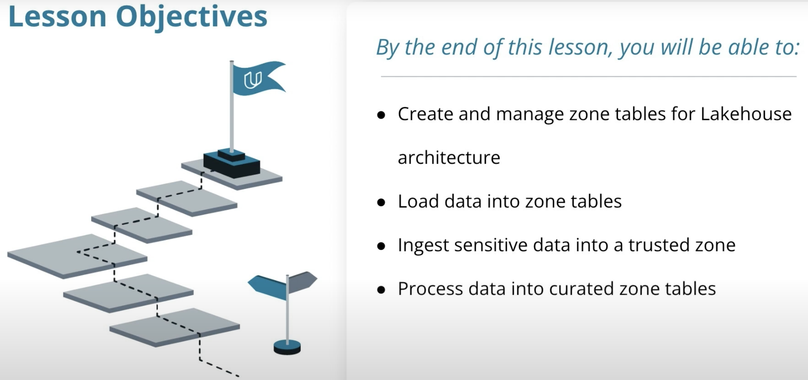

___

## 2 - Lakehouse Architecture

### The Lakehouse

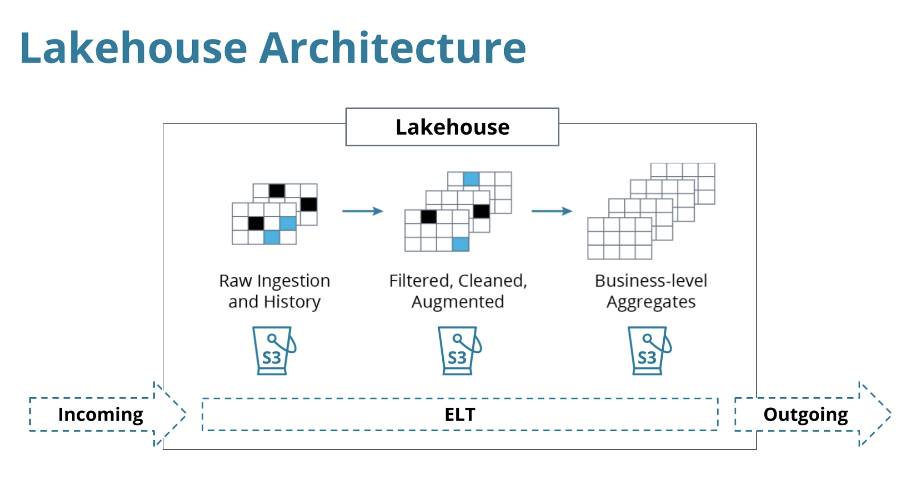

* The Lakehouse is another evolution of `data storage`. 
* The purpose of a Lakehouse is to `separate data processing into stages`. 
    * _Like an oil refinery, data is staged and processed step by step until it becomes available for querying._
* Lakehouse can be implemented using any `file storage and processing layer`. 
* In AWS, the most common way to store files is in S3, so we can implement the Lakehouse using `S3 storage`.

    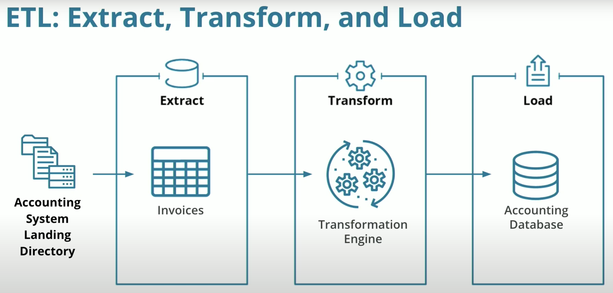

    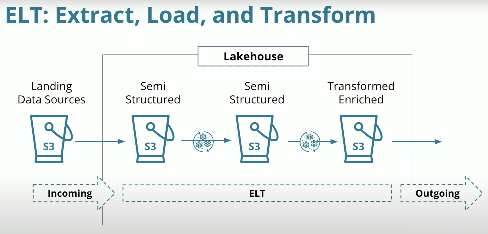


### Lakehouse Zones
* With `ETL`, usually data is going from a semi-structured (files in directories) format to a structured format (tables).
* With `ELT`, and with a `Lakehouse`, the data stays in `semi-structured` format, and the last zone contains enriched data where it can be picked up for processing later.
* `Deferring transformation` keeping the data at `multiple stages` in `file storage` _gives more options for later analytics, because it preserves all of the format._
    * _The original data is always available to be analyzed, transformed, and re-processed as needed._

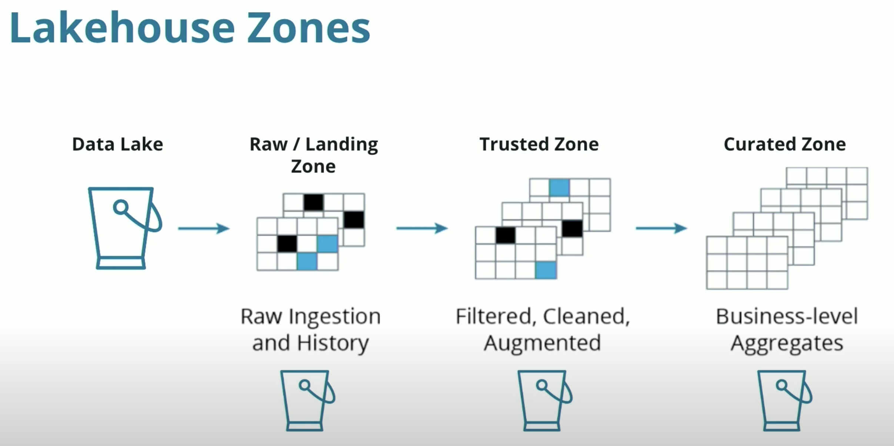

#### Raw/Landing Zone
_"For pipelines that store data in the S3 data lake, `data is ingested from the source into the landing zone as-is`. The processing layer then `validates` the landing zone data and stores it in the raw zone bucket or prefix for `permanent storage`."_

#### Trusted Zone
_"The processing layer applies the `schema`, `partitioning`, and other `transformations` to the raw zone data to bring it to `a conformed state` and stores it in trusted zone."_

#### Curated Zone
_"As a last step, the processing layer curates a trusted zone dataset by `modeling` it and `joining` it with other datasets, and stores it in curated layer."_
_"Typically, datasets from the curated layer are partly or fully ingested into Amazon Redshift `data warehouse` storage to serve use cases that need very l`ow latency access` or need to `run complex SQL queries`."_

Source: [Build a Lake House Architecture on AWS](https://aws.amazon.com/blogs/big-data/build-a-lake-house-architecture-on-aws/)

### Structure and Format

* Because querying and reading data from S3 is billed by the gigabyte, optimizing those queries is a very good idea. 
* Data can be compressed at a very high ratio, using `gzip` and other compression formats. 
* Whenever possible, data in S3 should also be in a `columnar format` like `parquet` files. This means that when issuing queries to S3, the entire row of data doesn't need to be scanned to locate a single field. The query becomes more efficient and cheaper.

___

## 3 & 4 - Use Glue Catalog to Query a Landing Zone

### Glue Catalog
* A [Glue Data Catalog](https://docs.aws.amazon.com/glue/latest/dg/components-overview.html) represents many sources and destinations for data. They can represent Kafka, Kinesis, Redshift, S3, and many more. 
    * If we want to connect to another data source, we must add it to the catalog. This makes querying data much easier.
* A [Glue Table](https://docs.aws.amazon.com/glue/latest/dg/tables-described.html) is a definition of a specific group of fields that represents a logical entity.
    * The Glue Catalog is made up of multiple table definitions.
    * **These tables are not physically stored in Glue.**
    * _**Glue tables are just a metadata catalog layer.**_ They store a reference to the data we can query or store.
* There are multiple ways to create Glue Tables, and we will focus on three ways to define a Glue Table in a Glue Catalog:
    * Use Glue Console to define each field 
    * Configure a Glue Job to generate a table definition automatically
    * Use SQL to define a table with DDL (Data Definition Language) or create statements

#### [AWS Athena](https://aws.amazon.com/athena/) - a Glue Catalog Query Tool
* Athena tool is a serverless query service where you can write SQL to run ad-hoc queries on S3 buckets.
* Athena uses S3 to store query results. 
    * we need to set up the location Athena will use from now going forward, e.g: 
        ```sh
        s3://dend-lake-house/athena/
        ```

### [Exercise Concept 1 - Define a Customer Landing Zone Table](./exercises/concept1-define-a-cusomter-landing-zone-table/)

* Create our first Glue Catalog Table - `customer_landing`

Practice implementing the lakehouse architecture by creating a `data catalog` and `landing zone` for customer data.

#### Context
* Create an `AWS Glue Catalog and table` from data in an `S3 bucket`. 
* After it's created, you'll `query the Glue Table` with `AWS Athena using SQL`


#### Step 1 - Add Database 

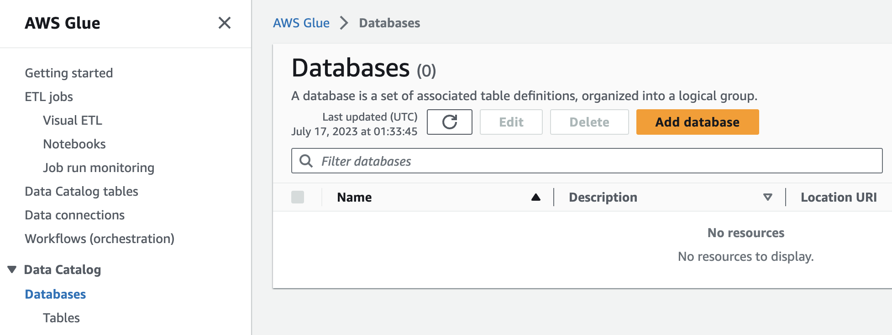


#### Step 2 - Add Table
_Define a table to allow us to query data in the landing zone for customers_

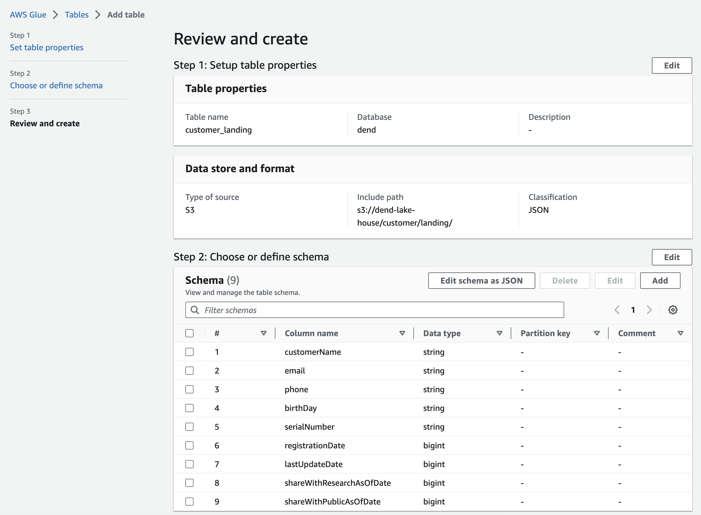

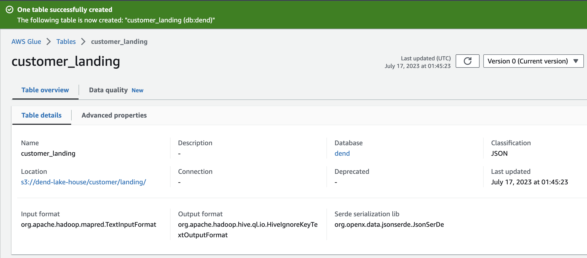


#### Step 3 - Query the table with Athena Query Editor

* Even though it's semi-structured JSON files, we can now use SQL queries to analyze the data before we start loading it. 
* We're seeing the data before we start loading it to address data quality issues or other considerations that we might have.

```sql 
select * from customer_landing;
```
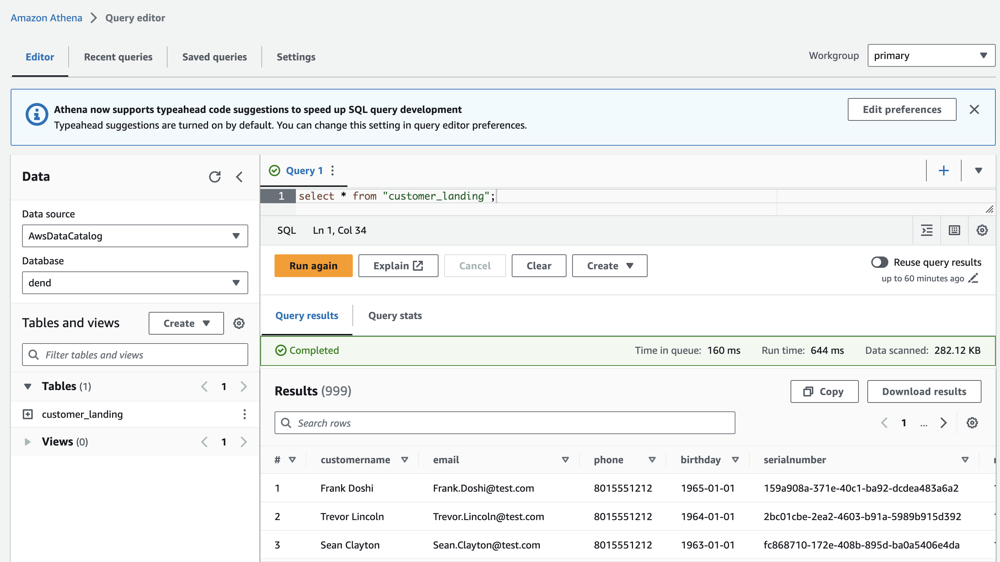

_Because it has not been scrubbed, invalid or unexpected data is often a feature of `landing zones`. We will later learn to remove invalid data from the fields before putting them in the `trusted zone`._
___

## Ingesting Sensitive Data + Data Privacy in Data Lakes

### [Exercise Concept 2 - Define Accelerometer Landing Zone with Athena](./exercises/concept2-define-an-accelerometer-landing-zone-table/)

Ingest accelerometer data into an S3 bucket and use AWS Athena to query the bucket and define a Glue Table from it.

* Step 1 - Ingest the accelerometer data into an S3 landing zone with the `s3 cp` command 
```sh
aws s3 cp ./accelerometer s3://dend-lake-house/accelerometer/landing/ --recursive
```
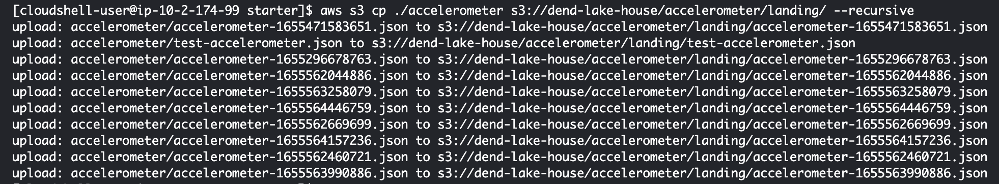

* Step 2 - Go to Athena, select the database, and create a new table from S3 bucket data

    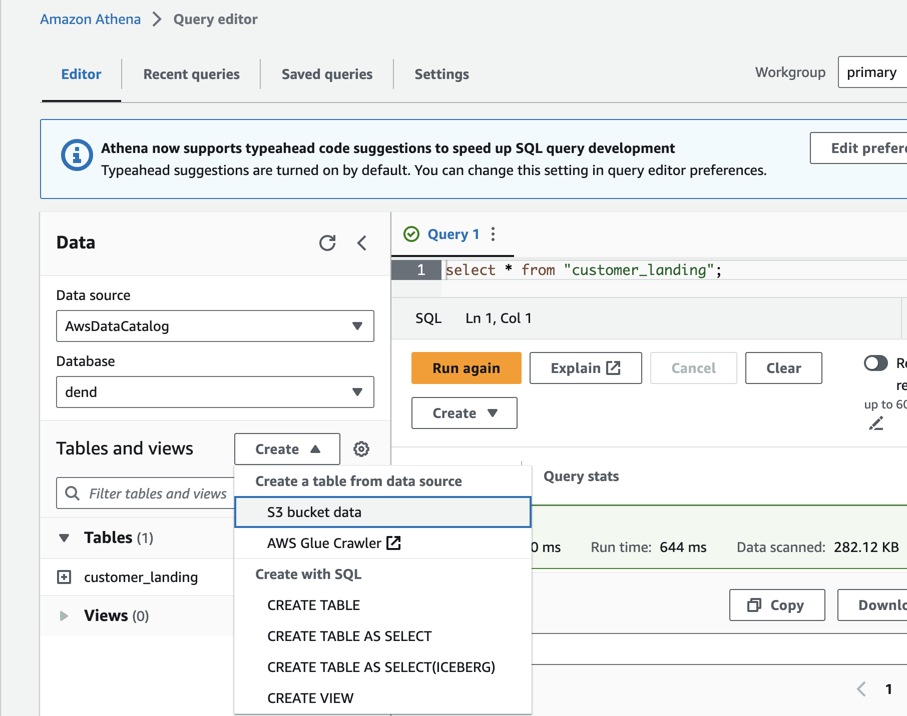

* Step 3 - Query Some Sample Data

    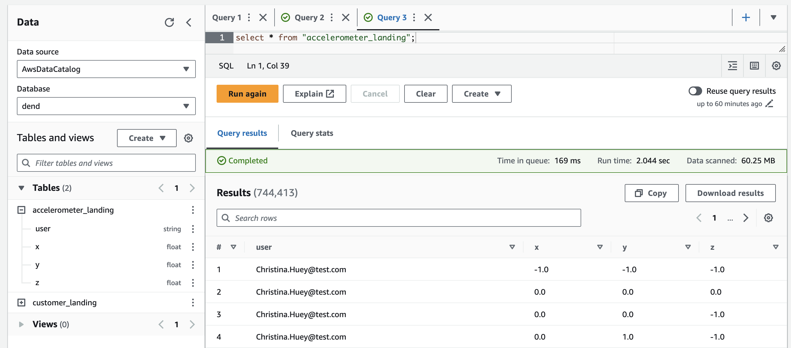
___


## 8 - Exercise: Athena Joins with Glue Catalog

### Exercise Concept 3 - Athena Joins with Glue Catalog

Query data in lakehouse zones to explore and identify tables and fields you can use for joins, filters, and other transforms to create a trusted zone.

#### Objective
Use AWS Athena to query `customer_trusted` table and `accelerometer_landing` table. Identify foreign key fields and write a SQL query to perform the join. Run the query and inspect the results.

```sql
select * from "accelerometer_landing" 
join "customer_trusted"
on "accelerometer_landing"."user" = "customer_trusted"."email"
```

And this ad-hoc query shows us that we can use that join in a future job to filter data in order to bring `accelerometer_landing` data forward from `landing` to `trusted` or for other purposes. 
___


## 9 & 10 - Joining with Secondary Tables

#### Create an Accelerometer Trusted Zone
Now that we have the sensitive data in the `accelerometer landing zone`, we can write a glue job that filters the data and moves compliant records into an `accelerometer trusted zone` for later analysis. 

### Exercise Concept 4 - Spark Glue Joins
Create an Accelerometer Trusted Zone

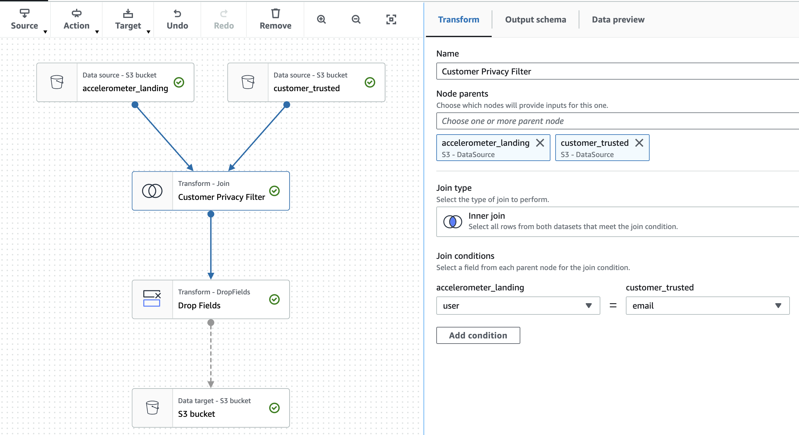

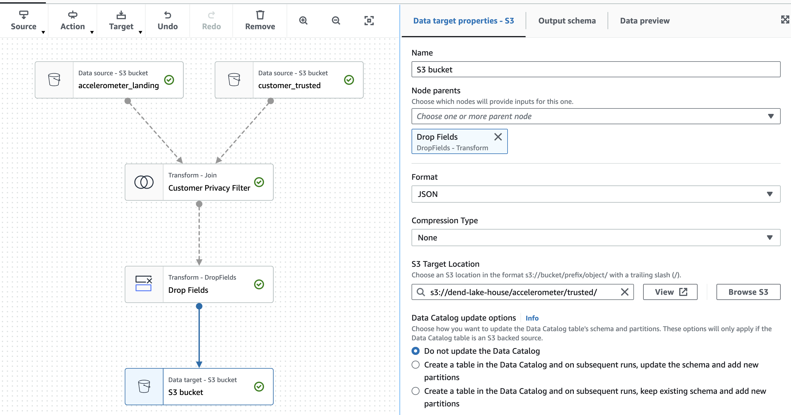

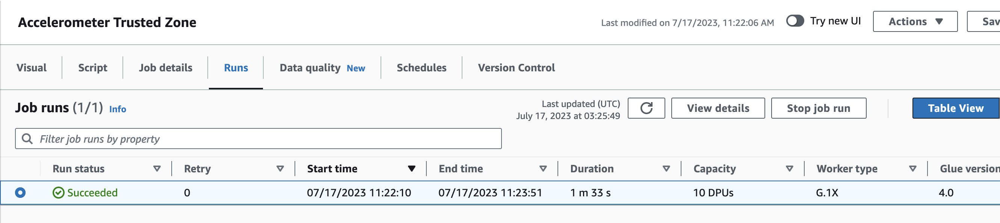
___

