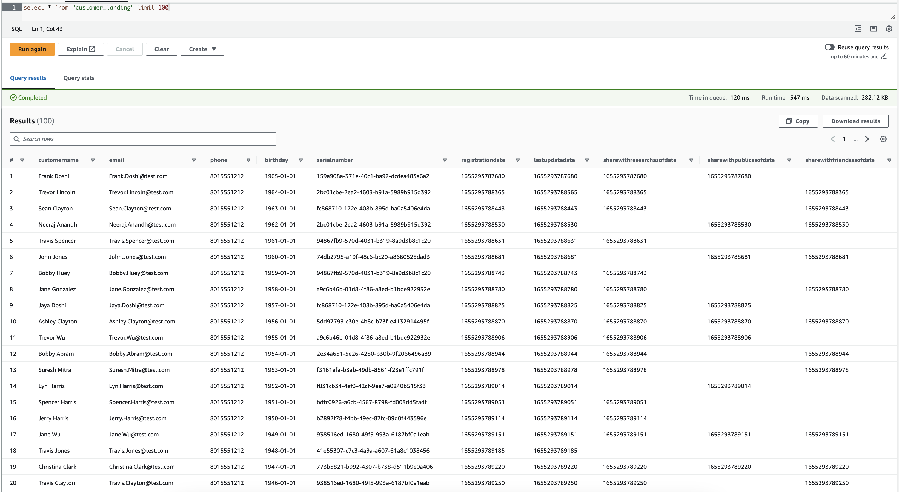
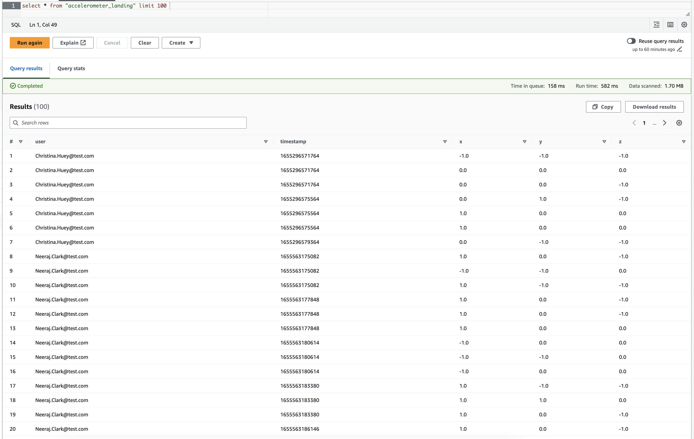
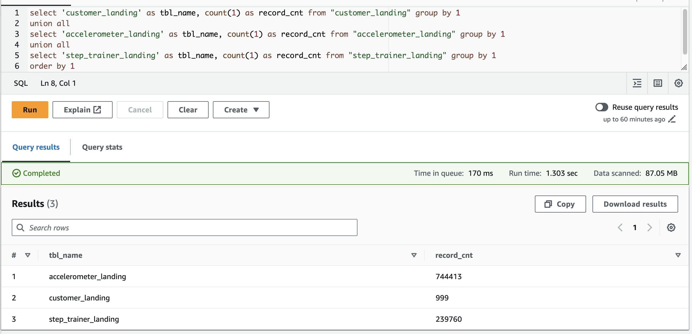
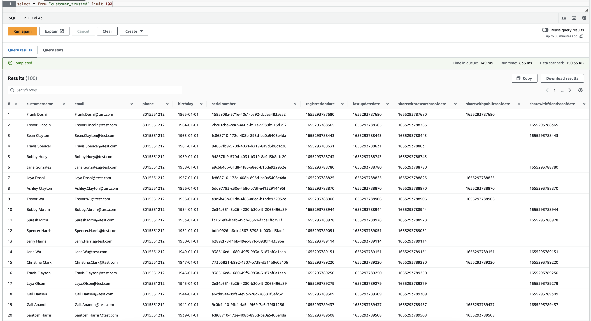
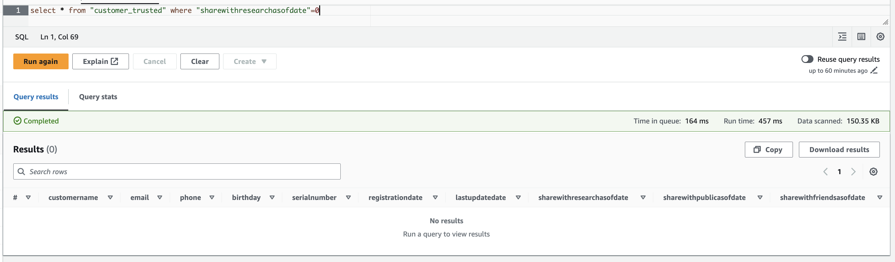
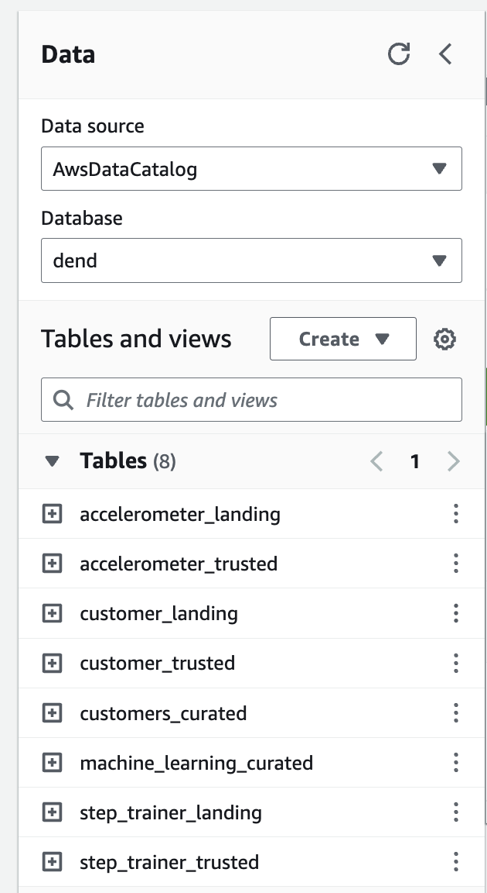

# Project 3 - STEDI Human Balance Analytics

## Project Introduction
Spark and AWS Glue allow you to process data from multiple sources, categorize the data, and curate it to be queried in the future for multiple purposes. 

In this project, as a data engineer on the STEDI Step Trainer team, you'll need to extract the data produced by the STEDI Step Trainer sensors and the mobile app, and curate them into a data lakehouse solution on AWS so that Data Scientists can train the learning model. 

## Project Details

The STEDI Team has been hard at work developing a hardware STEDI Step Trainer that:
* trains the user to do a STEDI balance exercise;
* and has sensors on the device that collect data to train a machine-learning algorithm to detect steps;
* has a companion mobile app that collects customer data and interacts with the device sensors.

STEDI has heard from millions of early adopters who are willing to purchase the STEDI Step Trainers and use them.

Several customers have already received their Step Trainers, installed the mobile application, and begun using them together to test their balance. The Step Trainer is just a motion sensor that records the distance of the object detected. The app uses a mobile phone accelerometer to detect motion in the X, Y, and Z directions.

The STEDI team wants to use the motion sensor data to train a machine learning model to detect steps accurately in real-time. _Privacy will be a primary consideration in deciding what data can be used._

Some of the early adopters have agreed to share their data for research purposes. **Only these customers’ Step Trainer and accelerometer data should be used in the training data for the machine learning model.**

## Project Summary

### Landing Zone

_**Glue Tables created (SQL DDL scripts):**_ 
* [customer_landing.sql](./scrips/customer_landing.sql)
* [accelerometer_landing.sql](./scrips/accelerometer_landing.sql)

_**Screenshot of select statements from Athena showing the customer landing data and accelerometer landing data:**_ 

* `customer_landing` table:

    

*  `accelerometer_landing` table: 

    

* record count check for each landing zone table: 

    

### Trusted Zone

_**Glue Job Scripts:**_ 
* [customer_landing_to_trusted.py](./scrips/customer_landing_to_trusted.py) - _Filter protected PII with Spark in Glue Jobs_
* [accelerometer_landing_to_trusted_zone.py](./scrips/accelerometer_landing_to_trusted_zone.py) - _Join Privacy tables with Glue Jobs_
* [step_trainer_landing_to_trusted.py](./scrips/step_trainer_landing_to_trusted.py) - _Populate `step_trainer_trusted` Glue Table that contains the Step Trainer Records data for customers who have accelerometer data and have agreed to share their data for research_

_**Use Athena to query Trusted Glue Tables**_ 

*  `customer_trusted` table: 

    

    

### Curated Zone

_**Glue Job Scripts:**_ 
* [customer_trusted_to_curated.py](./scrips/customer_trusted_to_curated.py)
* [trainer_trusted_to_curated](./scrips/trainer_trusted_to_curated.py) - _Populate `machine_learning_curated` Glue Table - an aggregated table that has each of the Step Trainer Readings, and the associated accelerometer reading data for the same timestamp, but only for customers who have agreed to share their data_

_**Screenshot of all Glue Tables**_ 

